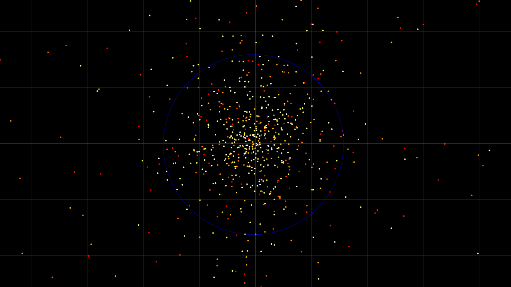

# :milky_way: Globular Cluster

## :sparkles: Star Dance Simulation

Create `data/conf.json` before using.<br>
Use `data/conf.template.json` as an example.<br>
Create `data/server.env` before using.<br>
Use `data/server.template.env` as an example.

***How to use:***
```bash
# Run on localhost
npm install
npm run server

# Run via Docker
docker compose --env-file "./data/server.env" build
docker compose --env-file "./data/server.env" up --detach

# Cleanup Docker
docker compose --env-file "./data/server.env" rm --stop --force
docker compose --env-file "./data/server.env" down --rmi "all"
```

***UI:*** http://localhost:1357/

***Admin UI:*** http://localhost:1357/admin.html


